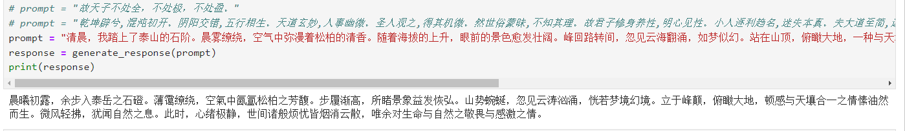

### Qwen2-7B-Instruct-Modern-to-Classical-Chinese
模型可通过huggingface下载体验：
[Qwen2-7B-Instruct-Modern-to-Classical-Chinese](https://huggingface.co/REILX/Qwen2-7B-Instruct-Modern-to-Classical-Chinese)

### 使用ChatGPT o1-preview 评估多个模型的输出在多个样例上REILX/Modern-Chinese-to-Classical-Chinese与Claude3.5Sonnet并列第一✿✿ヽ(°▽°)ノ✿

### 语料整理
将 https://github.com/NiuTrans/Classical-Modern 项目的语料整理为问答对的形式，用于训练
- **text_to_jsonl_converter.py**：
  - 按照总语料量的 30%，组织现代文-古文对，其余 70% 为古文-现代文对。</br>
**(使用以上语料训练后模型效果不佳，可能是prompt太长的原因，或者语料input、output太短导致学习有效性较差。)**

- **xiandai_ancient_to_jsonl_converter.py**：
  - 遍历指定目录及其子目录中的所有 'bitext.txt' 文件，提取其中的古文和现代文对应关系。
  - 将提取的文本对应关系组合成指定格式的 JSON 数据，并写入一个 JSONL 文件，同时确保每个 JSON 对象的总长度不超过 1024 个字符。</br>
**(使用尽可能长的文段生成训练语料。)**
  - 数据集可通过[REILX/Modern-Chinese-to-Classical-Chinese](https://huggingface.co/datasets/REILX/Modern-Chinese-to-Classical-Chinese)下载

### 模型训练
- 基础模型：[Qwen/Qwen2-7B-Instruct](https://huggingface.co/Qwen/Qwen2-7B-Instruct)
- 训练数据：[REILX/Modern-Chinese-to-Classical-Chinese](https://huggingface.co/datasets/REILX/Modern-Chinese-to-Classical-Chinese)
- 训练脚本：[hiyouga/LLaMA-Factory](https://github.com/hiyouga/LLaMA-Factory)
- 微调参数：
```bash
stage: sft
lora_rank: 32
lora_alpha: 64
finetuning_type: lora
lora_target: all
deepspeed: examples/deepspeed/ds_z3_config.json
learning_rate: 2.0e-5
num_train_epochs: 5.0
lr_scheduler_type: cosine
warmup_ratio: 0.05
```
- 训练时间：14小时46分

### Qwen2-7B-Instruct-Modern-to-Classical-Chinese 模型效果

```text
现代文：天地刚刚形成，混沌状态开始分离。阴阳力量交织，金木水火土五种元素相互生成。天道深奥难测，人间世事隐秘复杂。圣人观察这一切，理解了其中微妙的规律。然而，世人往往愚昧无知，不懂这些道理。因此，有修养的人注重自我完善，内心清澈。那些追逐利益、名声的小人，则迷失了自己的本质。真正的道理其实很简单，就是回归最原始的状态。要保持谦逊，如同山谷一样空旷，这样才能真正领悟到道。如果只坚持一种观点而忽视其他，最终只会导致偏颇。所以明智的人会审时度势，权衡各种利弊。顺应自然界的规律，不做违背自然的事情。只有这样，才能达到至善的境界，成就伟大的事业。

古文：天地之初，浑沌始开，阴阳交合，五行相生。天道玄远，人事幽微，圣人览观，得其机微；世之庸愚，不能明其理，故君子修己，心存澄澈，小人逐名利，失其本真。大道至简，复归于朴，谷虚如谷，方能悟道；执一弃万，终致偏颇，智者权衡，因时制宜，顺乎天，应乎物，方达至善，成大业。
```

```text
现代文：清晨，我踏上了泰山的石阶。晨雾缭绕，空气中弥漫着松柏的清香。随着海拔的上升，眼前的景色愈发壮阔。峰回路转间，忽见云海翻涌，如梦似幻。站在山顶，俯瞰大地，一种与天地融为一体的感觉油然而生。微风拂面，仿佛能听到大自然的呼吸。此刻，内心无比宁静，仿佛所有烦恼都已烟消云散，唯有对生命和自然的敬畏与感恩。

古文：晓日初上，步登泰岳之径，雾霭缭绕，松柏之气氤氲。渐行渐高，眼界愈宽，峰回路转，忽现云海翻腾，恍若仙境。临绝顶而眺，心旷神怡，天地之感油然而生。清风徐来，似闻自然之息，心灵宁静，烦恼尽消，唯余敬天畏生、感恩之情。
```

```text
现代文：夏日的午后，阳光透过树叶在地上投下斑驳的影子。我坐在公园的长椅上，看着来来往往的人群，思绪飘远。不远处，一对年轻的情侣正在草坪上野餐，他们的笑声轻快地飘荡在空气中。旁边的儿童游乐区里，孩子们欢快地奔跑、攀爬，充满了活力和童真。一位老爷爷正在给鸽子喂食，鸽群在他脚边盘旋，形成了一幅和谐的画面。微风拂过，带来一阵清凉，也带来了不知名花朵的香气。远处的湖面上，几只白鹭正悠闲地觅食，水面泛起微微的涟漪。天空中飘过几朵白云，懒洋洋地变换着形状。这样平凡而美好的一天，让人不禁感叹生活的美妙。虽然我们每个人都有自己的烦恼和压力，但在这样的时刻，一切似乎都变得不那么重要了。享受当下，感受生活中的每一个细节，或许这才是真正的幸福。我深吸一口气，闭上眼睛，让内心沉浸在这片刻的宁静中。当我再次睁开眼睛时，世界仿佛焕然一新，充满了希望和可能。

古文：夏之午，日光透叶，斑驳于地，吾坐于园之长凳，观人往来，思绪飘渺。遥闻不远之处，情侣二人，于草坪之上野餐，笑声轻扬，童稚游乐区，孩子们欢跑攀爬，生机盎然。老者喂鸽，鸽群盘旋足下，和谐相融。微风徐来，清凉带香，未知花之名，其香弥散。远处湖面，白鹭寻食，涟漪微动。天际白云，悠哉变换，不觉时光之流转，生活之美妙，尽在此刻。虽烦恼压力，亦暂忘却，享受此刻，感受生活之细微，此或为真幸福。深呼吸，闭眼静思，内心宁静，复睁眼，世界焕然一新，希望与可能，皆在其中。
```
### Qwen2-7B-Instruct 效果

```text
现代文：天地刚刚形成，混沌状态开始分离。阴阳力量交织，金木水火土五种元素相互生成。天道深奥难测，人间世事隐秘复杂。圣人观察这一切，理解了其中微妙的规律。然而，世人往往愚昧无知，不懂这些道理。因此，有修养的人注重自我完善，内心清澈。那些追逐利益、名声的小人，则迷失了自己的本质。真正的道理其实很简单，就是回归最原始的状态。要保持谦逊，如同山谷一样空旷，这样才能真正领悟到道。如果只坚持一种观点而忽视其他，最终只会导致偏颇。所以明智的人会审时度势，权衡各种利弊。顺应自然界的规律，不做违背自然的事情。只有这样，才能达到至善的境界，成就伟大的事业。

古文：自开辟之初，天地混沌始分，阴与阳交合，金木水火土五行互生。天之道幽远难测，人间之事纷纭莫辨。圣人观此万化，洞悉其微，而世人多昧于斯理。故君子务自我修明，心澄如镜。小人逐财名之利，失其本真。大道至简，归于淳朴之态。须谦逊若谷，空怀无欲，方能得道真谛。偏执一端而蔽于众说，终致失衡。智者审乎时变，度诸利弊，顺乎自然之理，不违其道。唯此，乃臻至善之境，成就伟业。
```

```text
现代文：清晨，我踏上了泰山的石阶。晨雾缭绕，空气中弥漫着松柏的清香。随着海拔的上升，眼前的景色愈发壮阔。峰回路转间，忽见云海翻涌，如梦似幻。站在山顶，俯瞰大地，一种与天地融为一体的感觉油然而生。微风拂面，仿佛能听到大自然的呼吸。此刻，内心无比宁静，仿佛所有烦恼都已烟消云散，唯有对生命和自然的敬畏与感恩。

古文：晨曦初露，余步入泰岳之石磴。薄霭缭绕，空氣中氤氲松柏之芳馥。步履渐高，所睹景象益发恢弘。山势蜿蜒，忽见云涛汹涌，恍若梦境幻境。立于峰颠，俯瞰大地，顿感与天壤合一之情愫油然而生。微风轻拂，犹闻自然之息。此时，心绪极静，世间诸般烦忧皆烟消云散，唯余对生命与自然之敬畏与感激之情。
```

```text
现代文：夏日的午后，阳光透过树叶在地上投下斑驳的影子。我坐在公园的长椅上，看着来来往往的人群，思绪飘远。不远处，一对年轻的情侣正在草坪上野餐，他们的笑声轻快地飘荡在空气中。旁边的儿童游乐区里，孩子们欢快地奔跑、攀爬，充满了活力和童真。一位老爷爷正在给鸽子喂食，鸽群在他脚边盘旋，形成了一幅和谐的画面。微风拂过，带来一阵清凉，也带来了不知名花朵的香气。远处的湖面上，几只白鹭正悠闲地觅食，水面泛起微微的涟漪。天空中飘过几朵白云，懒洋洋地变换着形状。这样平凡而美好的一天，让人不禁感叹生活的美妙。虽然我们每个人都有自己的烦恼和压力，但在这样的时刻，一切似乎都变得不那么重要了。享受当下，感受生活中的每一个细节，或许这才是真正的幸福。我深吸一口气，闭上眼睛，让内心沉浸在这片刻的宁静中。当我再次睁开眼睛时，世界仿佛焕然一新，充满了希望和可能。

古文：夏之正午，日光穿叶，斑驳之影洒于地。余坐于园中长凳，观行人熙攘，神思恍惚。稍远处，少壮情侣于草坪设宴，笑声轻盈，萦绕空气。旁有戏耍孩童，欢腾跳跃，生机勃勃，稚气盎然。老翁于地撒食，群鸽旋绕其足，构成一幅和谐景致。微风徐来，携不知名花香，凉意袭人。湖面远处，白鹭数只悠游觅食，波纹轻漾。天际云朵飘过，慵懒变换姿容。此平凡且美好之日，令人心生感慨，生活之妙。虽人人皆有忧愁与压力，然在此刻，诸般似乎不复重要。享受此刻，品味生命点滴，或即为此等真乐。深呼吸一口，闭目凝神，心沉浸于这瞬息之静谧。复睁眼视之，世间仿佛新生，充满希望与可能。
```

### 使用ChatGPT o1-preview对以下五类模型的输出评估
- REILX/Modern-Chinese-to-Classical-Chinese
- claude3.5sonnet
- gemini1.5pro
- gpt4
- gpt4o

**Prompt：**
```
请仔细阅读以下给定的现代汉语原文和多个大语言模型转换成的古文版本。请根据以下标准对这些转换进行评判和排序：
1.准确性（30分）：
古文版本是否准确传达了原文的全部信息？
是否有重要内容的遗漏或误译？
2.意思保留（25分）：
古文版本是否完整保留了原文的核心意思和情感？
读者能否从古文版本中获得与原文相同的理解？
3.风格一致性（20分）：
古文版本是否保持了原文的语言风格和语气？
是否成功地将现代表达方式转化为符合古代文学特征的表达？
4.文学特征（15分）：
使用的词语、句式是否符合古代文学的特征？
是否恰当运用了文言文特有的虚词、实词和语法结构？
5.整体雅致度（10分）：
古文版本是否具有典雅、流畅的文学美感？
是否成功营造出符合古文的意境和氛围？

请为每个版本在上述五个方面各自评分，并给出总分（满分100分）。然后，根据总分对所有版本进行排序，并简要说明您的排序理由。
最后，请指出您认为最佳的古文版本，并解释为什么它最为出色。
```

**样例1：**
```
排名：
claude3.5sonnet（100分）
REILX/Modern-Chinese-to-Classical-Chinese（100分）
gemini1.5pro（96分）
gpt4（94分）
gpt4o（89分）

排序理由：
claude3.5sonnet和REILX/Modern-Chinese-to-Classical-Chinese均得满分，但claude3.5sonnet在用词和表达上更具特色，如使用了“造化”等富有诗意的词汇，增加了文学美感。gemini1.5pro和gpt4虽有小瑕疵，但整体质量较高。gpt4o因存在误译，影响了准确性和意思保留，故排名稍后

现代文：
清晨，我踏上了泰山的石阶。晨雾缭绕，空气中弥漫着松柏的清香。随着海拔的上升，眼前的景色愈发壮阔。峰回路转间，忽见云海翻涌，如梦似幻。站在山顶，俯瞰大地，一种与天地融为一体的感觉油然而生。微风拂面，仿佛能听到大自然的呼吸。此刻，内心无比宁静，仿佛所有烦恼都已烟消云散，唯有对生命和自然的敬畏与感恩。

REILX/Modern-Chinese-to-Classical-Chinese
晨曦初启，吾登泰山之石阶。晨雾氤氲，松柏之馨香溢于空中。随高而上，所见愈加壮丽。峰回路转，忽见云海翻腾，若梦若幻。至顶俯瞰，天地浑然为一。微风拂面，似闻自然之息。此时心神澄净，众虑俱消，唯余对生命与自然之敬畏与感恩。

claude3.5sonnet
晨起，余踏泰山之阶。雾霭缭绕，松柏馨香盈袭。随步渐高，景愈壮丽。峰回路转，忽见云海翻腾，恍若梦幻。登峰远眺，俯瞰大地，不觉与天地浑然一体。微风拂面，似闻造化呼吸。此时此刻，心澄如镜，尘虑俱消，唯余敬畏自然，感恩生命之情油然而生。

gemini1.5pro
晓色初霁，余拾级登泰山。薄雾氤氲，松涛阵阵，清香沁人心脾。渐行渐高，景致愈发雄奇。山路蜿蜒，峰回路转之际，忽见云海翻腾，如浪如絮，恍若梦境。登顶远眺，山河壮丽，尽收眼底，顿生天地浩渺，万物一体之感。清风徐来，拂过面颊，似闻自然呼吸，令人心旷神怡。此时此刻，心如止水，万虑俱消，唯余对天地之敬畏，对生命之感恩，油然而生。

gpt4
晨光熹微，足登泰山之石階。晨霧縈繞，松柏之香滿溢於空。隨高程之升，景致愈盛，峰迴路轉，忽見雲海湧翻，宛若夢境，幻若真境。立巔峰之上，俯視諸世，心生天地合一之感。微風來拂，宛聞自然之吟呼。此際，心神甚寧，諸憂俱消，唯存對生與自然之崇敬與感激

gpt4o
晓日初上，步登泰岳之径，雾霭缭绕，松柏之气氤氲。渐行渐高，眼界愈宽，峰回路转，忽现云海翻腾，恍若仙境。临绝顶而眺，心旷神怡，天地之感油然而生。清风徐来，似闻自然之息，心灵宁静，烦恼尽消，唯余敬天畏生、感恩之情。
```

**样例2：**
```
排名：
claude3.5sonnet（100分）
REILX/Modern-Chinese-to-Classical-Chinese（100分）
gpt4（99分）
gemini1.5pro（97分）
gpt4o（97分）

排序理由：
claude3.5sonnet和REILX/Modern-Chinese-to-Classical-Chinese均得满分，但claude3.5sonne在用词和表达上更为精炼，如使用“耄耋翁”、“思绪飘然”等词，增强了文学美感，故排名第一。
gpt4稍有添加内容，但整体质量高，得分紧随其后。
gemini1.5pro和gpt4o由于存在小的遗漏或添加，影响了准确性和意思保留，故得分略低。

现代文：
夏日的午后，阳光透过树叶在地上投下斑驳的影子。我坐在公园的长椅上，看着来来往往的人群，思绪飘远。不远处，一对年轻的情侣正在草坪上野餐，他们的笑声轻快地飘荡在空气中。旁边的儿童游乐区里，孩子们欢快地奔跑、攀爬，充满了活力和童真。一位老爷爷正在给鸽子喂食，鸽群在他脚边盘旋，形成了一幅和谐的画面。微风拂过，带来一阵清凉，也带来了不知名花朵的香气。远处的湖面上，几只白鹭正悠闲地觅食，水面泛起微微的涟漪。天空中飘过几朵白云，懒洋洋地变换着形状。这样平凡而美好的一天，让人不禁感叹生活的美妙。虽然我们每个人都有自己的烦恼和压力，但在这样的时刻，一切似乎都变得不那么重要了。享受当下，感受生活中的每一个细节，或许这才是真正的幸福。我深吸一口气，闭上眼睛，让内心沉浸在这片刻的宁静中。当我再次睁开眼睛时，世界仿佛焕然一新，充满了希望和可能。

REILX/Modern-Chinese-to-Classical-Chinese
夏日午后，日光透树，斑驳影落于地。吾坐于园中长椅，观人群往来，思绪悠然。不远处，少情侣于草间野餐，笑声轻盈，随风飘荡。旁有儿童游乐，嬉笑奔跑，攀爬跳跃，活力童真，洋溢其间。一翁喂鸽，鸽群绕足而飞，画面自成和谐。微风徐来，带清凉气，兼不知名之花香。远湖之上，白鹭数只闲然觅食，水面微澜。天际白云数朵，懒懒变幻，形态不定。如此平凡之日，令人不禁赞叹生活之妙。虽人各有忧烦，然于此时，皆成轻淡。享受当下，感悟生活之细，或为真幸福。吾深吸气，闭目，心神沉于片刻之静谧。再睁眼，世界焕然，充满希望与无尽可能。

claude3.5sonnet
夏日午后，日影斑驳，树叶婆娑。余坐园中长椅，观往来人潮，思绪飘然。不远处，少年俊侣席地而食，欢声悦耳，飘荡于空。旁侧童戏之所，稚子奔跑攀缘，生气勃勃，天真烂漫。一耄耋翁方以谷饲鸽，群鸽盘旋其足，和谐如画。微风徐来，清凉袭人，携不知名花香。远望湖面，白鹭数只，悠然觅食，水波微漾。天际浮云片片，慵懒变幻其形。此平凡而美好之日，令人不禁叹曰：生之妙哉！虽人各有忧患压力，然此刻一切皆化为虚无。享此时此刻，体味生之细微，此或为真正之福。余乃深吸一气，闭目沉浸于刹那宁静。及睁目时，天地焕然，希冀与可能充盈于怀。

gemini1.5pro
夏日午后，阳光透叶，地投斑驳之影。我凭长椅于公园，观往来人群，心思飘然。不远草坪，一对青年恋人野餐于此，笑声轻盈，飘荡空中。傍有儿童戏区，孩童奔走攀爬，充斥活力与童趣。一老翁施食鸽群，鸽绕其足，构和谐画卷。微风拂来，送清凉亦带花香。远湖上，白鹭悠闲觅食，水面生涟漪。天穹飘白云，懒洋变形。此等平凡美日，令人感生活之美好。纵人各承烦忧压力，于此刻，诸事似皆轻微。享此时，感生活细节，或此真幸福也。我深吸一气，合目，心沉宁静。既复开眼，世界如新，盈望与可。

gpt4
夏日午后，艳阳高照，树影斑驳，洒落一地。余坐于园中长椅之上，观人来人往，思绪飘忽。不远处，一对璧人席地而坐，共享佳肴，笑语盈盈，随风而来。旁侧童嬉之处，孩童追逐嬉戏，攀援跳跃，天真烂漫，朝气蓬勃。更有老者，俯身喂鸽，群鸽环绕，构成一幅祥和之景。微风拂面，带来丝丝清凉，更有不知名花香，沁人心脾。极目远眺，湖面之上，白鹭数只，悠然觅食，水波荡漾，泛起阵阵涟漪。天高云淡，白云悠悠，变幻莫测。如此平凡美好之日，令人不禁感叹人生之美妙。诚然，吾等皆有烦忧压力，然于此刻，一切皆似无关紧要。活在当下，感受生活点滴，或许此乃真幸福也。余深吸一口气，闭目凝神，沉浸于这片刻宁静之中。待到再次睁眼之时，世界仿佛焕然一新，充满希望与可能。

gpt4o
夏之午，日光透叶，斑驳于地，吾坐于园之长凳，观人往来，思绪飘渺。遥闻不远之处，情侣二人，于草坪之上野餐，笑声轻扬，童稚游乐区，孩子们欢跑攀爬，生机盎然。老者喂鸽，鸽群盘旋足下，和谐相融。微风徐来，清凉带香，未知花之名，其香弥散。远处湖面，白鹭寻食，涟漪微动。天际白云，悠哉变换，不觉时光之流转，生活之美妙，尽在此刻。虽烦恼压力，亦暂忘却，享受此刻，感受生活之细微，此或为真幸福。深呼吸，闭眼静思，内心宁静，复睁眼，世界焕然一新，希望与可能，皆在其中。
```

**样例3：**
```
排名：
claude3.5sonnet（100分）
REILX/Modern-Chinese-to-Classical-Chinese（100分）
gpt4o（99分）
gemini1.5pro（97分）
gpt4（90分）

排序理由：
claude3.5sonnet和REILX/Modern-Chinese-to-Classical-Chinese均得满分，但claude3.5sonnet在用词和表达上更为精炼，结构严谨，故排名第一。
gpt4o准确性略有不足，但整体表现优秀，故排名第三。
gemini1.5pro因部分用词稍有偏差，影响了准确性和意思保留，排名第四。
gpt4存在用词和表达上的问题，影响了准确性和雅致度，故排名第五。

现代文：
天地刚刚形成，混沌状态开始分离。阴阳力量交织，金木水火土五种元素相互生成。天道深奥难测，人间世事隐秘复杂。圣人观察这一切，理解了其中微妙的规律。然而，世人往往愚昧无知，不懂这些道理。因此，有修养的人注重自我完善，内心清澈。那些追逐利益、名声的小人，则迷失了自己的本质。真正的道理其实很简单，就是回归最原始的状态。要保持谦逊，如同山谷一样空旷，这样才能真正领悟到道。如果只坚持一种观点而忽视其他，最终只会导致偏颇。所以明智的人会审时度势，权衡各种利弊。顺应自然界的规律，不做违背自然的事情。只有这样，才能达到至善的境界，成就伟大的事业。

REILX/Modern-Chinese-to-Classical-Chinese
天地初辟，混沌既分，阴阳交织，五行相生。天道幽深莫测，人事隐晦多端。圣人观之，悟其妙理。而世人每多愚昧，不识其道。是故，君子贵修身，内心澄澈；小人逐利名，反失其本。夫道至简，归于本真。谦虚若谷，方得大道。执一偏见，终致失正，智者权衡时势，审度得失。顺天理，不逆其道，斯能至善，成大业焉。

claude3.5sonnet
天地初开，混沌始分。阴阳交织，五行相生。天道玄妙，人事幽微。圣人观之，洞悉其理。众生愚昧，莫明斯旨。故君子修身，澄怀观道。小人逐利，迷失本真。大道至简，返璞归真。虚怀若谷，方能得道。执一而偏，终成偏颇。是以智者审时，权衡利弊。顺乎自然，勿违天理。如此而行，可臻至善，成就大业。

gemini1.5pro
天地初开，混沌始分。阴阳交泰，五行相生。天道幽玄，人世纷繁。圣人观之，洞悉其理。然世人愚蒙，多有弗知。是以君子修身，明心见性。小人逐利，迷失本真。大道至简，返璞归真。虚怀若谷，方能容道。执一而论，终陷偏颇。智者达观，权衡利弊。顺应自然，无为而治。如此，方臻至善，功成名就。

gpt4
天地初开，混元始分。陰陽交錯，金木水火土生相乎。天道幽遠，世事幽冥。聖人窺斯一切，察其微妙之規。然民多昧，不識其理。故君子修身以求其明，心如明鏡。小人徇利名，迷失本性。真道甚易，唯歸於本初。宜保謙虛，若谷之虛，乃能悟道之真。執一偏而忽諸視，終至偏頗。智者審時度勢，權諸利弊，順自然之常，不為逆耳。如是，乃可至善之域，成就非凡。

gpt4o
天地之初，浑沌始开，阴阳交合，五行相生。天道玄远，人事幽微，圣人览观，得其机微；世之庸愚，不能明其理，故君子修己，心存澄澈，小人逐名利，失其本真。大道至简，复归于朴，谷虚如谷，方能悟道；执一弃万，终致偏颇，智者权衡，因时制宜，顺乎天，应乎物，方达至善，成大业。
```

### 致谢
本项目受益于 [LLaMA-Factory](https://github.com/hiyouga/LLaMA-Factory/blob/main/README_zh.md)、[Classical-Modern](https://github.com/NiuTrans/Classical-Modern)，感谢以上诸位作者的付出。